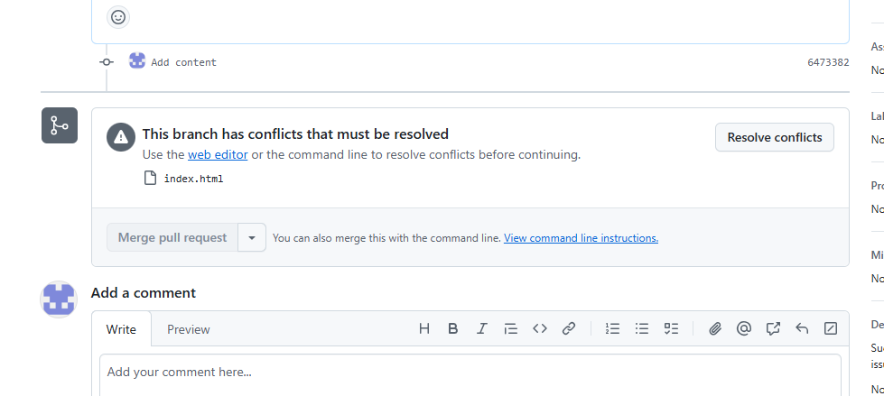
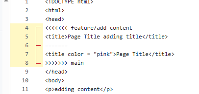
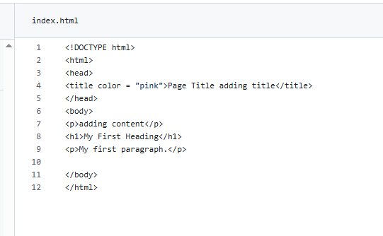
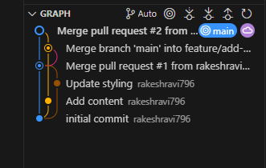

<h1> Branching Strategies & Merge Conflicts </h1>

<h2>Link of GitHub repo</h2>
<a href = "https://github.com/rakeshravi796/git-assignment-3">https://github.com/rakeshravi796/git-assignment-3</a>

<h2> Merge conflict </h2>

<h3>Pull request for the second branch done after merging the first one , Merge conflict</h3>

<h3> The conflict </h3>

<h2> Resolving conflict </h2>

Kept the styling from the main branch and also adding the content from feature/add-content. This Keeps the essential parts from both the branches.

Merged both changes succesfully 

